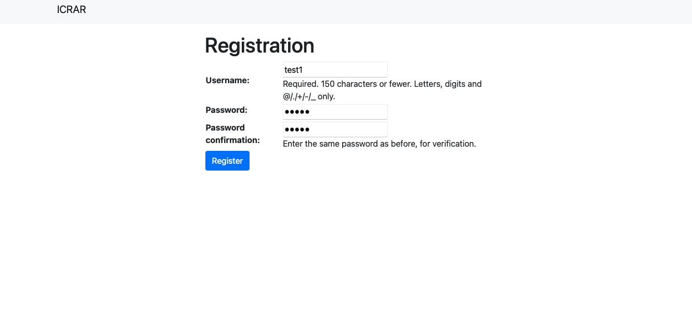

# 2023-CITS3200-Team26's Wave Dashboard

### The Stack

- Django for both back-end & front-end

### How to Set Up
#### Initial Setup
1. Have python installed in your system, this project uses python 3.11
2. Make a virtual environment inside the project directory `python3 -m venv venv`
3. Enter the virtual environment `source venv/bin/activate`
4. Install project dependencies `pip install -r requirements.txt`
5. Set up our Django application’s database
    1. `cd backend`
    2. `python manage.py makemigrations`
    3. `python manage.py migrate`
    4. `python manage.py collectstatic`

#### Gunicorn Deployment
The project comes with configuration files for `nginx` and `gunicorn`. However, we still need to install `nginx` because we can't install it through pip.
1. Install `nginx` if we haven't already through your package manager `sudo yum install nginx`
2. Move the the `nginx` configuration file to the appropriate location `sudo mv conf/backend/ etc/nginx/sites-available`
3. Start up `nginx` `sudo systemctl start nginx`

#### Running HTTPS
We’ll be using certbot to add HTTPS. Follow [these instructions](https://certbot.eff.org/instructions?ws=nginx&os=pip) from the Certbot official website.

### How to Run
#### Back-End
##### Script
1. Ensure the script is executable run `chmod +x run.sh`
2. Run the script, direct execution `./run.sh`

##### Manual (gunicorn)
1. to start the server, run `gunicorn -c conf/gunicorn_conf backend.wsgi`

## Setting up Login with 2FA

1. `domain name`/account/register/
2. Create Username and Password

3. Login & Click "Enable Two-Factor Authentication"
4. Select the Token Generator method
5. Scan QR code into your preferred authenticator application (ie Microsoft Authenticator, Google Authenticator)

6. Enter the OTP (updated every 30 seconds)
7. Padlock on navigation bar displays that 2FA has been implemented

